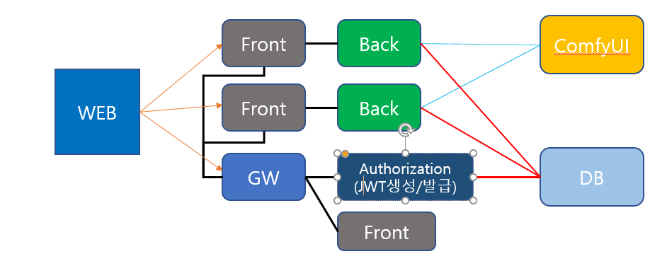

[프로젝트 기능 정리.xlsx 다운로드](https://github.com/Solodkfl/.github/raw/main/profile/프로젝트%20기능%20정리.xlsx)

| gotham | pixel | 
|:-----:|:--------:|
| [](https://github.com/CHOIBEAR) | [](https://github.com/hiedupixel) 
| [고담](https://github.com/higotham) | [픽셀](https://github.com/hiedupixel) 
<!--

**Here are some ideas to get you started:**

🙋‍♀️ A short introduction - what is your organization all about?
🌈 Contribution guidelines - how can the community get involved?
👩‍💻 Useful resources - where can the community find your docs? Is there anything else the community should know?
🍿 Fun facts - what does your team eat for breakfast?
🧙 Remember, you can do mighty things with the power of [Markdown](https://docs.github.com/github/writing-on-github/getting-started-with-writing-and-formatting-on-github/basic-writing-and-formatting-syntax)
-->

## Generating Asymmetric Keys with OpenSSL
1. [windows openssl 설치]("https://slproweb.com/products/Win32OpenSSL.html")
2. openssl 버젼 확인
```cmd
openssl -v
```
3. Generate a KeyPair
```cmd
openssl genrsa -out keypair.pem 2048
```
4. Generate a Public Key
```cmd
 openssl rsa -in keypair.pem -pubout -out publicKey.pem 
```
5. Generate a Private Key
```cmd
openssl pkcs8 -topk8 -inform PEM -outform PEM -nocrypt -in keypair.pem -out privateKey.pem
```
6. Spring boot : `properties` 생성
```
@ConfigurationProperties(prefix = "jwt")
 public record RSAKeyRecord (
  RSAPublicKey rsaPublicKey, RSAPrivateKey rsaPrivateKey
 ) {}
```
7. 등록한 Properties 활성화 적용하기
```
@EnableConfigurationProperties(RSAKeyRecord.class)
@SpringBootApplication
public class SpringSecurityApplication {

    public static void main(String[] args) {
        SpringApplication.run(SpringSecurityApplication.class, args);
    }

}
```
8. Location of file in properties
```yml
jwt:
  rsa-private-key: classpath:certs/privateKey.pem
  rsa-public-key: classpath:certs/publicKey.pem
```
9. Jwt 설정 적용하기
```java
@Configuration
@RequiredArgsConstructor
public class JwtConfig {

  private final RsaKeyProperties rsaKeys;

  @Bean
  public JwtEncoder jwtEncoder() {
    JWK jwk = new RSAKey.Builder(rsaKeys.publicKey()).privateKey(rsaKeys.privateKey()).build();
    JWKSource<SecurityContext> jwks = new ImmutableJWKSet<>(new JWKSet(jwk));
    return new NimbusJwtEncoder(jwks);
  }

  @Bean
  public JWKSet jwkSet() {
    RSAKey.Builder builder = new RSAKey.Builder(rsaKeys.publicKey())
        .keyUse(KeyUse.SIGNATURE)
        .algorithm(JWSAlgorithm.RS256)
        .keyID("public-key-id");
    return new JWKSet(builder.build());
  }

  @Bean
  public JwtDecoder jwtDecoder() {
      JWKSource<SecurityContext> jwkSource = new ImmutableJWKSet<>(jwkSet());
      return new NimbusJwtDecoder(jwkSource);
  }

}
```
10. JwkDecoder 를 위한 jwkSet 요청 URI 생성
```java
@RestController
@RequiredArgsConstructor
public class JwkSetController {

  private final JWKSet jwkSet;

  @GetMapping("/.well-known/jwks.json")
  public Map<String, Object> keys() {
    return jwkSet.toJSONObject();
  }

}
```
11. jwkSet 요청 URI를 이용하여 JwkDecoder 하는 Bean 생성
```java
public class SecurityConfig {

  private String jwkSetURI = "/.well-known/jwks.json";

  @Bean
  public JwtDecoder jwtDecoder() {
    return NimbusJwtDecoder.withJwkSetUri(jwkSetURI).build();
  }

}
```
